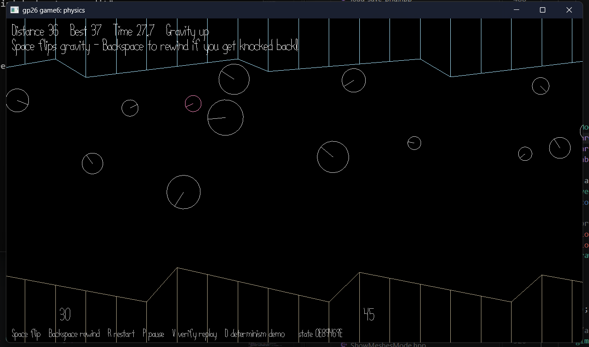

# Gravity Shot

Author: Jerry Wang (jerrywa2)

Design: This is a obstacle course game where the player shoots a ball, and uses gravity flipoing to try to get it as far as possible.

Screen Shot:

How To Play:

Use space bar to flip gravity. Most of the ground and ceiling are slanted forwards, allowing you to bounce forwards if you're careful.

## Extra Credit

Are your Physics Deterministic? If so, how can we verify this?

Are your Physics Rewindable? If so, how can we verify this?

This game was built with [NEST](NEST.md).
